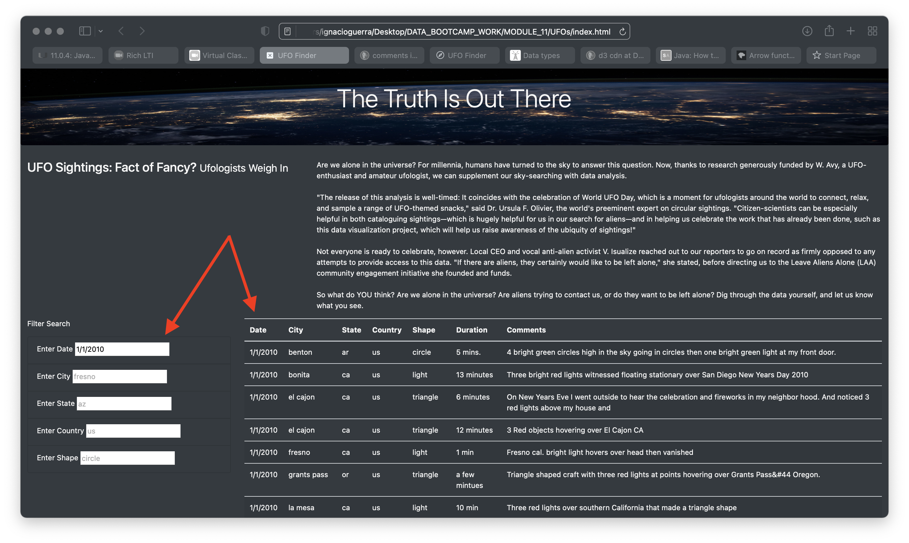
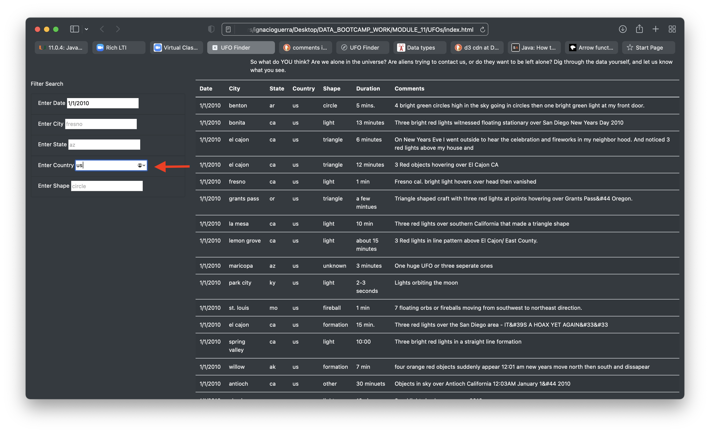

# UFOs

## Project Overview

Dana, a data journalist, is writing an article about her home town, McMinnvile, Oregon, known for its UFO sightings. To accompany her article, Dana asked us to help her in creating  an interactive webpage that allows readers to parse the data around these and other sightings.

After creating the webpage, Dana would now like to provide a more in-depth analysis of UFO sightings by allowing users to filter for multiple criteria at the same time, not just by date. In addition to the date, she asked us to add filters for city, state, country, and shape and to dynamically generate the filtered data table.

### Methodology

For this project, we used Bootstrap elements to create a webpage based on the storyboard that Dana provided. The webpage is stored as *index.html* and the styles where customized to meet Dana's requirements. These styles are stored in a *css* file under the *static/css/* folder path.

The file containing the searchable data is named *data.js* and together with the *javascript* file named *app.js*, which defines the filtering functions and table presentation, are stored in the *static/js/* folder path.

Additionally, we utilized the *D3.js* (Data-Driven Documents) library by linking it directly into our *HTML* page from the *Content Delivery Network (CDN)*.

## Results

The completed webpage has five input boxes for date, city, state, country and shape. Once a filter is selected and filter data provided, the table is dynamically updated.

For example, if a user wants to see all the sightings observed on 1/1/2010, the filtered results would show as follows:

The user may then want to further filter the list only for the United States:

If for example, the user would like to find all the sightings for the state of California (CA), on that date, the table will reflect the filtered results as seen below:

A further drill down for the city of El Cajon would then return the following results:

Finally, if the user wishes to filter all sightings where the UFO's shape was triangular, the webpage will provide sightings with only those shapes, for that date, country, state and city.

## Summary

In a summary statement, describe one drawback of this new design and two recommendations for further development.

